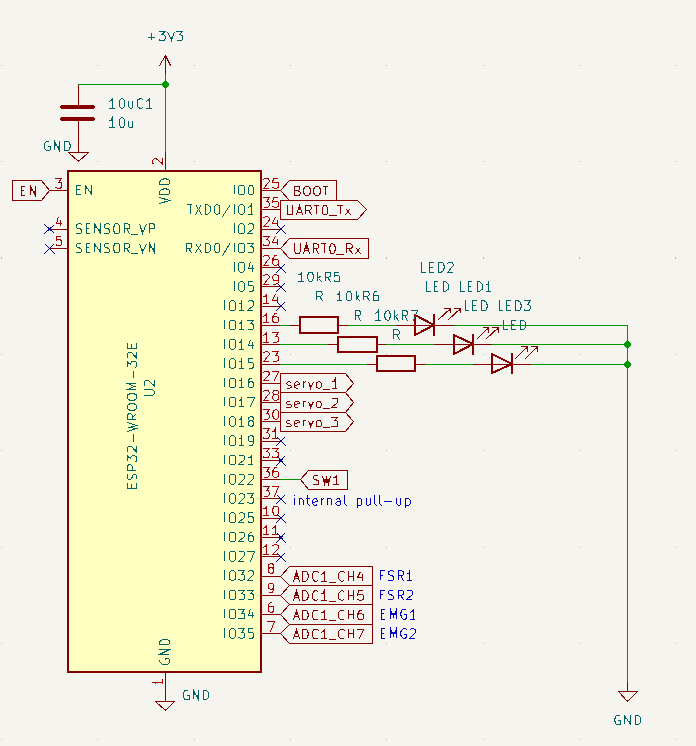

# BootCamp2026
K研究室の新人向け研修会　

## 開発環境
platform IO (vscode拡張機能)
環境構築はこちらの記事を参考にしてね
    https://learn.ee3.jp/platformio/

ライブラリはESPServo 1.2.1ライブラリ使用
可視化ツールとして Teleplot(vscode拡張機能)のインストール推奨

## 書き込み
pioのターミナルを開いて, 以下を実行
- データの消去(ライブラリのリンクでエラーが出た場合)
```
pio run --target erase
```
- ファイル書き込み(大体これだけでOK 普通のUpload)
```
pio run --target upload
```
- jsなどのライブラリファイル書き込み
```
pio run --target uploadfs
```


## ESP32のピン番号(IOポート番号)
### ADC(センサ)
```ADC_lib.hpp
#define EMG_PIN_1 34
#define EMG_PIN_2 35
#define FSR_PIN_1 32
#define FSR_PIN_2 33
```

### サーボ
```Servo_lib.hpp
#define SERVO_PIN_1 16
#define SERVO_PIN_2 17
#define SERVO_PIN_3 18
```

### LED
```Task_Maneger.hpp
#define LED1_PIN 14
#define LED2_PIN 13
#define LED3_PIN 15
```

### MODEボタン
```Task_Maneger.hpp
#define MODE_SWITCH 22
```

